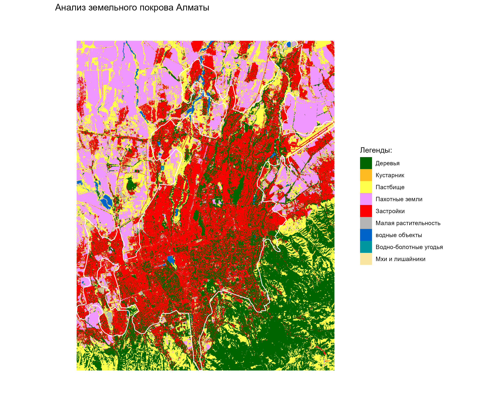

# Almaty-land-cover

I have conducted an analysis of the land cover of Almaty

I developed this visualization using the R programming language using the libraries: arctic,sf, terra, arc gis layers, tidyverse, elevatr, tidyterra

Why is this necessary:

Land cover analysis can help urban planners better understand the structure of a city and optimize the development of infrastructure such as roads, residential areas, recreation areas and industrial areas.

Optimization of infrastructure: roads, residential areas, recreation areas and industrial areas.
🌳 Identification of ecologically significant areas: forests, reservoirs, areas with a high risk of erosion.
Optimization of land use in agriculture.
🗺️ Natural resource management: forests, reservoirs, groundwater.
Forecasting of natural disasters: floods, landslides.
🗺️ Geopolitical interests: control over strategic zones, defining borders.
